### README

# Predicting Shipping Order Delivery Status

### Business Understanding

The project will help predict a packages deliverable status as either Late Delivery, Advance Shipping, and Ship on time. 

##### Data

The data being used is information from a company's supply chain about shipping orders like payment type, customer information, order information, delivery dates and status. The timeframe of the model is from 2015-01 - 2018-02.

Some features were removed because they cause data leakage, redundant information, or added too many features when converting categorical data. 

##### Method

This project will observe the delivery status of orders compared to some features, and create a model to predict if the order is late, on time, or in advance. I compared delivery status to each month, shipping mode, market, and customer segment. Each feature showed about half the orders are late delivery.For predicting models, I used logistic regression as a baseline, then random forest and XGBoost, and random search to optimize parameters. 

### EDA

The overall delivery status shows more than half the orders are late delivery. 

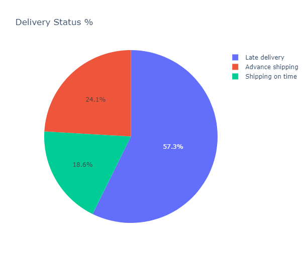

The line plot shows the orders from 2015-01 - 2017-10. 

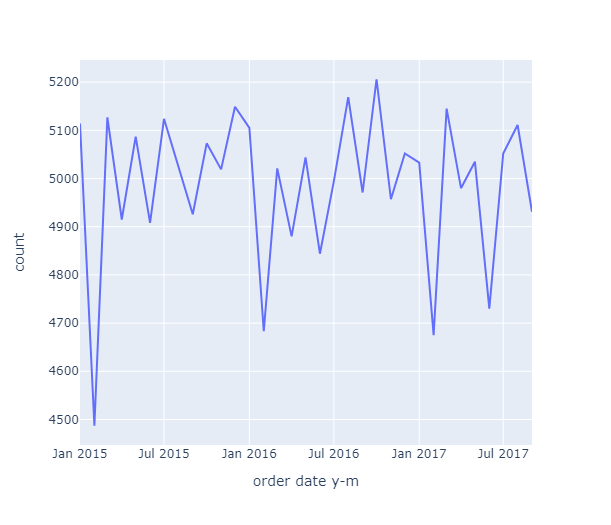

The graph implies there is usually a drop in orders from January and Febrary.

This plot shows each month's delivery status count. 

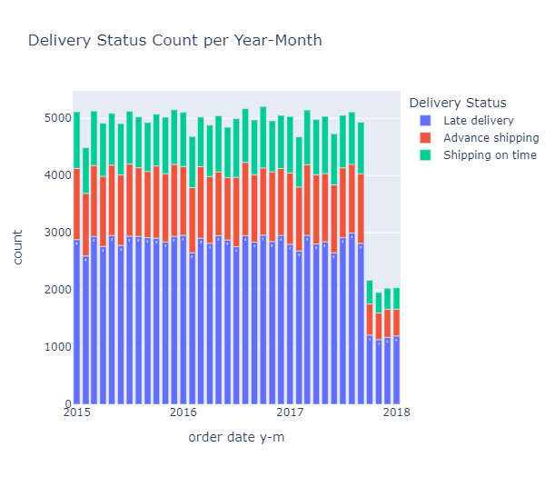

Between 2500 and 3000 orders are late per month. 

***

#### Delivery Status Count in Other Features

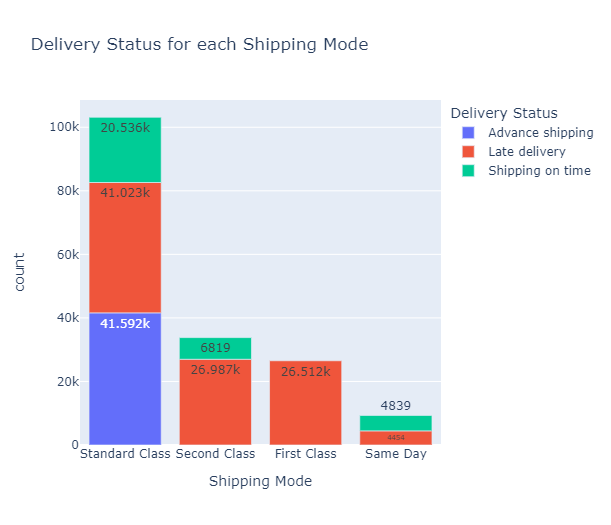

Here we can note that none of the First Class orders are on time, and Second Class has mostly late deliveries. Standard Class has the least relative late deliveries. 

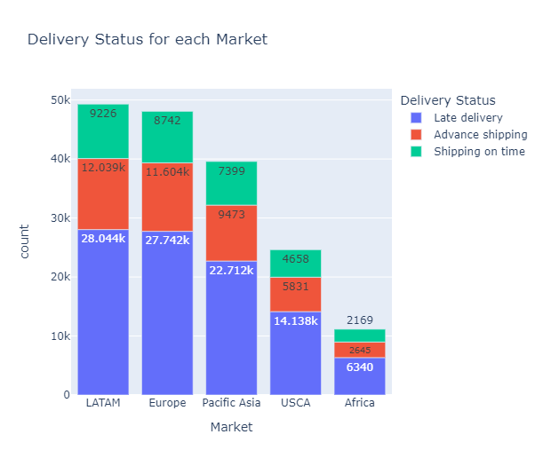

Here we can see a Market's Delivery Status. Each Market has about half late delivery orders. 

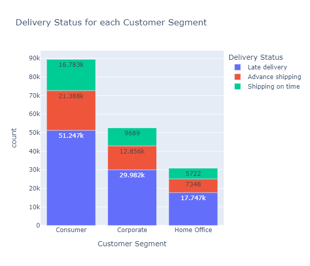

Each Customer Segment's Delivery status shows over half the orders are late delivery. 

##### Baseline Model

The baseline model will be based off a training set using logistic regression. This model's overall accuracy is 0.60.

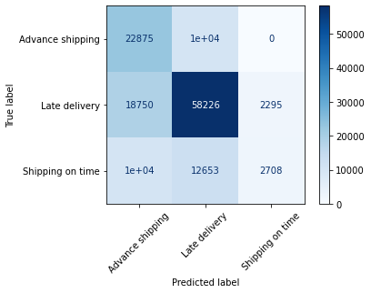

#### Logistic Regression Model

The testing set with our logistic regression does not improve overall score with 0.61.

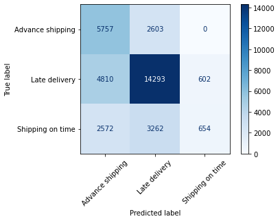

#### Random Forest Model

Random Forest test model improved overall score to 0.70.

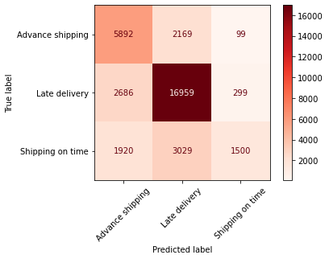

#### XGBoost Model

XGBoost test model overall accuracy score (0.66) improves on the logistic regression models, but not random forest. 

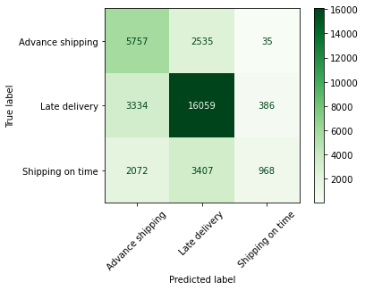

#### Random Search Model

Using random search on our Random Forest and XGBoost models to find optimal parameters to find the best predictor. 

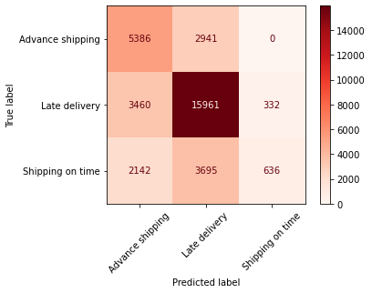
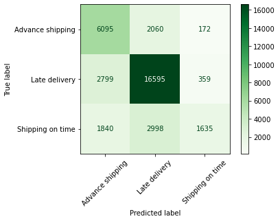

Random Search for Random Forest (0.64) only does better than the logistic regression models. Random Search for XGBoost (0.71) is the best overall scoring model. 

### Conclusion

In conclusion Random Search XGBoost marginally did the best overall score with predicting delivery status 0.71. On time shipping could take away from the overall accuracy of the model, its values could be close to the other variables, making it hard for the model to distinguish between late and advance delivery. 

##### Next Steps

Overall, there is over half late deliveries, some features delivery status were looked at, but perhaps comparing a customer's information type to their location, and see if that has an affect on delivery status. This could help identify why there are late deliveries. 
