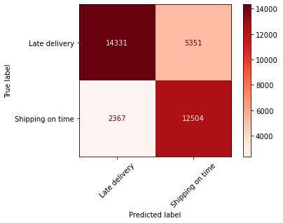

### README

# Predicting Shipping Order Delivery Status

### Business Understanding

Everyone wants their package delivered on time, but as we know this, does not always happen for many reasons. The project aims to predict a packages deliverable status as either Advance Shipping, and Ship on time, Late Delivery. This will help the company expect potential late deliveries and incurring customer service expenses or start discussing a plan to avoid a high volume of late deliveries. 

##### Data

The data being used is information from a company's supply chain about shipping orders like payment type, customer information, order information, delivery dates and status. The timeframe of the model is from 2015-01 - 2018-02.

- Type
- Scheduled Days for Shipment
- Sales per Customer
- Delivery Status
- Customer Segment
- Customer Zipcode
- Department ID
- Department Name
- Latitude
- Longitude
- Market
- Order Item Discount
- Order Item Discount Rate
- Order Item ID
- Order Item Product Price
- Order Item Profit Ratio
- Order Item Quntity 
- Sales
- Order Profit Per Order
- Order Region
- Shipping Mode
- Order Date Year-Month
- Shipping Date Year-Month
- Order Date Year

Some features were removed because they cause data leakage, redundant information, or added too many features when converting categorical data. 

##### Method

This project will observe the delivery status of orders compared to some features, and create a model to predict if the order is late, on time, or in advance. I compared delivery status to each month, shipping mode, market, and customer segment. Each feature showed about half the orders are late delivery.For predicting models, I used logistic regression as a baseline, then random forest and XGBoost, and random search to optimize parameters. 

### EDA

The overall delivery status shows more than half the orders are late delivery. 

The line plot shows the orders from 2015-01 - 2017-10. 

The graph implies there is usually a drop in orders from January and Febrary.

This plot shows each month's delivery status count. 

Between 2500 and 3000 orders are late per month. 

***

#### Delivery Status Count in Other Features

Here we can note that none of the First Class orders are on time, and Second Class has mostly late deliveries. Standard Class has the least relative late deliveries. 

Here we can see a Market's Delivery Status. Each Market has about half late delivery orders. 

Each Customer Segment's Delivery status shows over half the orders are late delivery. 

##### Baseline Model

The baseline model will be based off a training set using logistic regression. This model's overall accuracy is 0.60.

### Advanced vs On Time vs Late Delivery Models

#### Logistic Regression Model

The testing set with the logistic regression does not improve overall score with 0.61.

#### Random Forest Model

Random Forest test model improved overall score to 0.70.

#### XGBoost Model

XGBoost test model overall accuracy score (0.66) improves on the logistic regression models, but not random forest. 

#### Random Search Model

Using random search on our Random Forest and XGBoost models to find optimal parameters to find the best predictor. 

Random Search for Random Forest (0.64) only does better than the logistic regression models. Random Search for XGBoost (0.71) is the best overall scoring model. 

### On Time vs Late Delivery Models

The models seem to have difficulty differentiating between Advanced Delivery and Shipping on Time. I think ultimately the customer want to know if thier package is on time or late. So I decided to see the accuracy of the models when I combine Advanced and Shipping on Time. 

#### Logistic Regression

The testing set with the logistic regression when observing only Shipping on Time and Late Delivery does not improve overall score with 0.70.

#### Random Forest Model

Random Forest test model improved overall score to 0.78 when observing Shipping on Time and Late Delivery.

#### XGBoost Model

XGBoost test model resulted at .74, the second best model with our obsrvations. 

#### Random Search Model

The adjusted hyperparameters for Random Forest and XGBoost with scores .71 and .78 respectivly. 

### Conclusion

In conclusion Random Search XGBoost marginally did the better overall score with predicting delivery status between Advanced, Shipping on Time, and Late Delivery at 0.71. On time shipping could take away from the overall accuracy of the model, its values could be close to the other variables, making it hard for the model to distinguish between late and advance delivery. Therefore, when I combined Advanced and Shipping on Time, the models improved with Random Search XGBoost model being the best classifier at .78

##### Next Steps

Overall, there is over half late deliveries, some features delivery status were looked at, but perhaps comparing a customer's information type to their location, and see if that has an affect on delivery status. This could help identify why there are late deliveries. 
